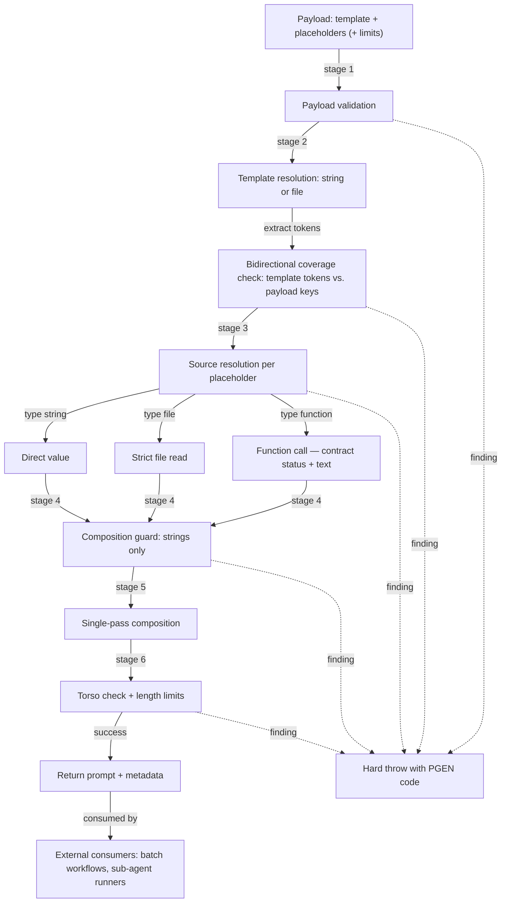

<!-- TODO on publication: swap the static Tests badge for a live test-on-push.yml status badge + Codecov badge once the repo has a remote -->
  

# memo-init-prompt-generator

A deterministic prompt compositor for homogeneous mass batches: a template
plus typed placeholders go in, a validated prompt string plus metadata come
out. Non-deterministic prompt generation degrades over long batches — a
hand-written prompt drifts a little with every unit, and after hundreds of
units nobody can say which sub-agent actually started from which mission.
This module makes the starting point exactly reproducible: same payload,
same prompt, same hash — every time.

The module is deliberately small in code and maximal in validation. Every
defect in a prompt multiplies across the whole batch, so no prompt ever
leaves the generator with findings: validation failures are hard throws
with AI-readable `PGEN-` error codes, never partial results.

## What This Module Is NOT

These guarantees are the contract of the module — they hold by design:

- **No LLM calls** — pure composition plus validation. The generator never
  talks to a model.
- **No agent or workflow orchestration** — batching, sub-agent calls and
  completeness checks live with the consumer (see
  [Reference Workflow](docs/reference-workflow.md)).
- **No domain concepts baked in** — no persona special-handling (a persona
  block is just one possible placeholder among many), no grading areas, no
  schema awareness, no domain assumptions.
- **No mandatory placeholders** — the template defines the placeholder set;
  the generator enforces bidirectional coverage, nothing more.
- **Portable across projects** — the generator is deliberately generic and
  usable in any project that needs reproducible prompts.

And one positive guarantee on top: **hard validation**. No prompt leaves
the generator with errors (hard throw), no empty strings, no torso prompts
(leftover `{{...}}` tokens fail), `null`/`undefined` are never stringified,
every finding carries an AI-readable `PGEN-` code, and there are no silent
defaults.

## Architecture

The generator runs a fixed six-stage pipeline; any finding at any stage is
a hard throw with a `PGEN-` code:



## Quickstart

Clone the repository and install dependencies:

```bash
# NOTE: placeholder URL — this repository is not yet published.
git clone https://github.com/Memo-Init/prompt-generator.git
cd prompt-generator
npm i
```

Compose a first prompt (self-contained, runs as-is from the repo root):

```javascript
import { PromptGenerator } from './src/index.mjs'

const buildStepPlan = async ( { steps } ) => {
    const text = steps
        .map( ( step, stepIndex ) => `${stepIndex + 1}. ${step}` )
        .join( '\n' )

    return { 'status': true, text }
}

const { prompt, metadata } = await PromptGenerator.generate( {
    'template': { 'type': 'string', 'value': 'Mission for {{NAMESPACE}}:\n{{STEP_PLAN}}' },
    'placeholders': {
        'NAMESPACE': { 'type': 'string', 'value': 'demo' },
        'STEP_PLAN': { 'type': 'function', 'fn': buildStepPlan, 'args': { 'steps': [ 'read the input', 'write the output' ] } }
    }
} )

console.log( prompt )
console.log( metadata.prompt.hash )
```

## Features

- **Three typed placeholder sources** — `string` (direct value), `file`
  (file is read completely; missing or empty file = hard error) and
  `function` (callable with `args`); every entry is an object with an
  explicit `type`, no shorthand values.
- **Bidirectional template validation** — every template `{{KEY}}` token
  must be covered by a payload key, and every payload key must occur in the
  template.
- **Double-checked function contract** — placeholder functions must return
  exactly `{ status: true, text }` with a non-empty string `text`; shape,
  status and text are each verified by the generator.
- **Torso check** — single-pass composition; any `{{...}}` token that
  survives substitution fails the run. No half-filled prompt ever leaves
  the generator.
- **Hard `PGEN-` error codes** — every finding is thrown with a code from
  the frozen registry (see [Error Codes](#error-codes)); messages are
  AI-readable with location context.
- **`{ prompt, metadata }` return** — per-placeholder source, length and
  sha256 hash, plus the same record for template and composed prompt.
- **CLI entry** — compose a whole unit list from a config module into
  prompt files plus a `manifest.json` (see [CLI](#cli)).
- **Batch usage** — the recommended batch operating model (worklist,
  batches, sub-agents with empty context, completeness check) is documented
  in [docs/reference-workflow.md](docs/reference-workflow.md).

## Table of Contents

- [memo-init-prompt-generator](#memo-init-prompt-generator)
  - [What This Module Is NOT](#what-this-module-is-not)
  - [Architecture](#architecture)
  - [Quickstart](#quickstart)
  - [Features](#features)
  - [Methods](#methods)
    - [.generate()](#generate)
    - [CLI](#cli)
  - [Error Codes](#error-codes)
  - [Contributing](#contributing)
  - [License](#license)

## Methods

The module exposes one class with one public static method:
`PromptGenerator.generate()`. The package entry `src/index.mjs` additionally
exports the frozen error-code registry `ERROR_CODES` and the two default
limit constants `DEFAULT_MAX_PROMPT_LENGTH` (1,000,000 characters) and
`DEFAULT_MAX_PLACEHOLDER_VALUE_LENGTH` (500,000 characters).

### .generate()

Composes a prompt from a template and typed placeholder sources. The method
is `async` (file and function sources resolve asynchronously) and either
returns `{ prompt, metadata }` or throws a hard error listing every finding
as `PGEN-XXX {location}: {detail}` — there are no partial results.

**Method**

```
await PromptGenerator.generate( { template, placeholders, limits } )
```

| Key | Type | Description | Required |
|-----|------|-------------|----------|
| template | object | Template source: `{ type: 'string', value }` or `{ type: 'file', filePath }` — type `function` is not allowed for templates. The resolved template must contain at least one `{{KEY}}` token (key grammar `^[A-Z][A-Z0-9_]*$`). | Yes |
| placeholders | object | One entry per template token; at least one entry. Keys must match `^[A-Z][A-Z0-9_]*$`. Every entry is an object with an explicit `type` (see sub-key table below) — shorthand values are rejected. | Yes |
| limits | object | Optional overrides `{ maxPromptLength, maxPlaceholderValueLength }` — positive integers. Omitted keys fall back to the exported defaults. | No |

Sub-keys per `template` / `placeholders` entry:

| Sub-Key | Type | Applies to | Description | Required |
|---------|------|------------|-------------|----------|
| type | string | every entry | One of `string`, `file`, `function` (templates: `string` or `file` only). | Yes |
| value | string | type `string` | The literal text to insert — non-empty, no null bytes. | For `string` |
| filePath | string | type `file` | Path to the source file, read completely as UTF-8. Missing, empty/whitespace-only or invalidly encoded files are hard errors. Recorded verbatim in the metadata. | For `file` |
| fn | function | type `function` | Sync or async function, called once with `args` as its single object parameter. Must return exactly `{ status: true, text }` with a non-empty string `text` — shape, status and text are double-checked. | For `function` |
| args | object | type `function` | The single object parameter passed to `fn`; must be a plain object when present. | No |

**Example**

```javascript
import { PromptGenerator } from './src/index.mjs'
import { buildStepPlan } from './my-inputs.mjs'

const { prompt, metadata } = await PromptGenerator.generate( {
    'template': { 'type': 'file', 'filePath': 'templates/about-namespace.md' },
    'placeholders': {
        'NAMESPACE': { 'type': 'string', 'value': 'moralis' },
        'PERSONA_BLOCK': { 'type': 'file', 'filePath': 'personas/data-engineer.md' },
        'STEP_PLAN': { 'type': 'function', 'fn': buildStepPlan, 'args': { 'namespace': 'moralis', 'schemas': [] } }
    }
} )
```

**Returns**

```
returns Promise<{ prompt, metadata }>
```

| Key | Type | Description |
|-----|------|-------------|
| prompt | string | The fully composed prompt — guaranteed free of unresolved `{{...}}` tokens and within the length limits. |
| metadata | object | Provenance record: `metadata.template`, `metadata.prompt` and one `metadata.placeholders[KEY]` entry per placeholder (shape below). |

Each metadata record has this shape:

| Key | Type | Description |
|-----|------|-------------|
| source | string | `string`, `file`, `function` — or `generated` for the composed prompt. |
| length | number | Character length of the resolved text. |
| hash | string | sha256 hex of the resolved text. |
| filePath | string | File sources only — the `filePath` exactly as supplied in the payload. |
| functionName | string | Function sources only — `fn.name`, or `<anonymous>` for anonymous functions. |

### CLI

The CLI composes a whole unit list from a config module into one prompt
file per unit plus a `manifest.json`:

```bash
node src/cli.mjs --config=<config.mjs> --out=<dir>
```

The config module must export **exactly one** of the two forms:

```javascript
// my-batch.config.mjs — exports EXACTLY ONE of: units | buildUnits

// form 1: static unit list
export const units = [
    {
        'id': 'unit-001',
        'payload': {
            'template': { 'type': 'file', 'filePath': 'templates/unit.md' },
            'placeholders': {
                'SUBJECT': { 'type': 'string', 'value': 'first subject' }
            }
        }
    }
]

// form 2 (alternative): async factory, e.g. derived from a worklist file
// export async function buildUnits() { return { units } }
```

Behavior:

- Unit `id`s must match `^[A-Za-z0-9][A-Za-z0-9_-]*$` and be unique — they
  become the prompt file names (`<id>.md`).
- Composition is sequential and fail-fast: the first failing unit aborts
  the run with the unit id in the message; `PGEN-` codes stay visible.
- The write phase is all-or-nothing: nothing is written before every unit
  composed successfully. An existing target file is a hard error listing
  all colliding paths — **there is no force/overwrite flag**; re-run
  against a fresh or emptied directory.
- Exit code `0` on success, `1` on any error (message plus usage line on
  stderr).

Path hygiene: prefer `filePath` values **relative to the invocation CWD**
in config files — the manifest records each `filePath` exactly as supplied
(`metadata.…filePath` pass-through), so module-relative (absolute) paths
surface as absolute paths in `manifest.json`. If a config resolves paths
that way, treat the manifest as a local artifact and do not commit it.

A complete consumer example lives in
[examples/usecase-about/](examples/usecase-about/); the batch operating
model around the CLI is documented in
[docs/reference-workflow.md](docs/reference-workflow.md).

## Error Codes

All findings carry a code from the frozen registry in
`src/data/errorCodes.mjs` (the single source of truth for code and tests).
Every code has severity `ERROR`: each finding triggers a hard throw — no
prompt ever leaves the generator with findings.

| Code | Severity | Description |
|------|----------|-------------|
| PGEN-001 | ERROR | Required parameter missing — `undefined` or `null` at a mandatory position (payload, template, placeholders, entry fields). |
| PGEN-002 | ERROR | Type mismatch for parameter — value does not have the required type or structure. |
| PGEN-003 | ERROR | Parameter or value must not be empty — empty strings and empty placeholder sets are forbidden. |
| PGEN-004 | ERROR | Invalid source type — not one of `string`, `file`, `function` (no shorthand, no implicit types). |
| PGEN-005 | ERROR | Substitution value is not a string at composition time — `null`, `undefined`, object or number is a type anomaly caught before composition. |
| PGEN-010 | ERROR | Template contains no placeholders — at least one `{{KEY}}` token is required. |
| PGEN-011 | ERROR | Template placeholder not covered by payload — every template token needs a matching placeholders key. |
| PGEN-012 | ERROR | Payload key not used in template — every placeholders key must occur in the template. |
| PGEN-013 | ERROR | Malformed placeholder token in template — token matches `{{...}}` but violates the placeholder grammar. |
| PGEN-020 | ERROR | Source file is missing or not readable. |
| PGEN-021 | ERROR | Source file is empty — whitespace-only content counts as empty. |
| PGEN-030 | ERROR | Function threw an exception or returned a rejected promise — caught and rethrown as a coded error with function context. |
| PGEN-031 | ERROR | Function returned wrong shape — must be a plain object with exactly the keys `{ status, text }`. |
| PGEN-032 | ERROR | Function status is not explicitly `true` — `false`, `'true'`, `1` or a missing status is a hard error. |
| PGEN-033 | ERROR | Function text is not a non-empty string. |
| PGEN-040 | ERROR | Unresolved `{{...}}` token survived substitution — no half-filled prompt ever leaves the generator. |
| PGEN-050 | ERROR | Composed prompt exceeds maximum length. |
| PGEN-051 | ERROR | Resolved placeholder value exceeds maximum length. |
| PGEN-052 | ERROR | Invalid encoding in source content — U+FFFD replacement character or null byte detected. |

## Contributing

Contributions are welcome! Please open an issue first to discuss what you
would like to change.

## License

[MIT](LICENSE)
